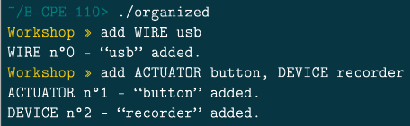

# Documentation Organized

Bienvenue sur la documentation de la commande add

La fonction add permet d'ajouter un ou plusieurs éléments à la liste d'objet.

Il faut renseigner un type et un nom et cela va créer un objet avec l'ID le plus petit disponible.

Fait par | [Julien LEINER ](https://github.com/Julien-Lnr) 