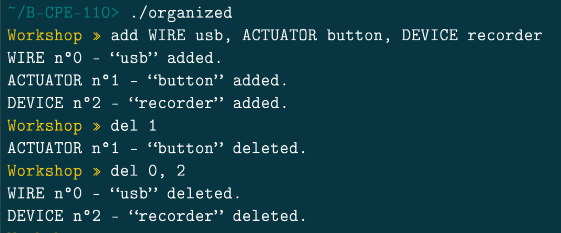

# Documentation Organized

Bienvenue sur la documentation de la commande del

La fonction del permet de supprimer un ou plusieurs éléments de la liste d'objet.

Il faut renseigner un ou plusieurs ID.

Fait par | [Julien LEINER ](https://github.com/Julien-Lnr) 