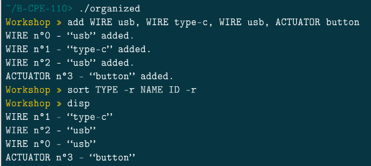

# Documentation Organized

Bienvenue sur la documentation du projet Organized

Il s'agit du projet de 1ère année à Epitech

Il fut réalisé seul

L'objectif est de créer une gestion d'objets en utilisant une librairie créant un shell.

Il est composé en 4 parties :

- La fonction add
- La fonction del
- La fonction disp
- La fonction sort

Fait par | [Julien LEINER ](https://github.com/Julien-Lnr) 