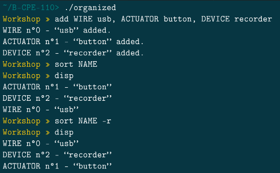

# Documentation Organized

Bienvenue sur la documentation de la commande sort

La fonction sort permet de trier la liste d'objet.

On peut trier soit par ID, soit par nom, soit par type.

L'argument -r permet de trier dans l'ordre inverse.

Fait par | [Julien LEINER ](https://github.com/Julien-Lnr) 